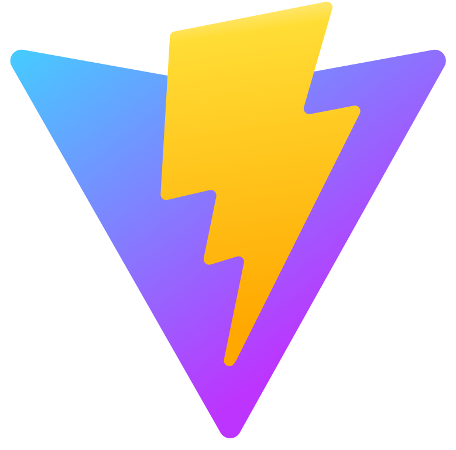

 
  <h1>Hi🖐🏻, I'm Endi</h1> 

### About me 
- 👦🏻 I'm 16 years old
- 👨🏻‍🎓 I'm a student
- 💻 I'm a Frontend Developer
- 🌱 I’m currently learning **Databases**
- 🌍 I speak English
- 🧑‍💻 I've been programming for **4** years
- 🎴 I watch anime
  
------------------------

### Skills

  
  
  
  
  
  
  
  
  

------------------------

### Tools

  
  
  

# 💻 Tech Stack:
           

   
# 📊 GitHub Stats:
 
 

---

<!-- Proudly created with GPRM ( https://gprm.itsvg.in ) -->
